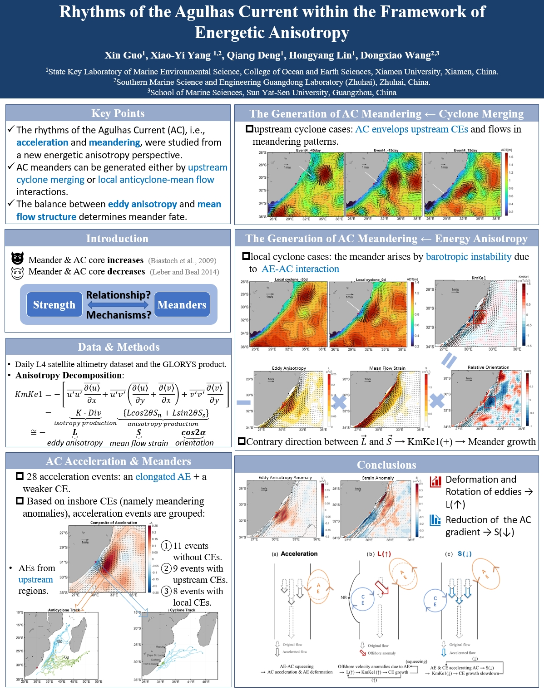
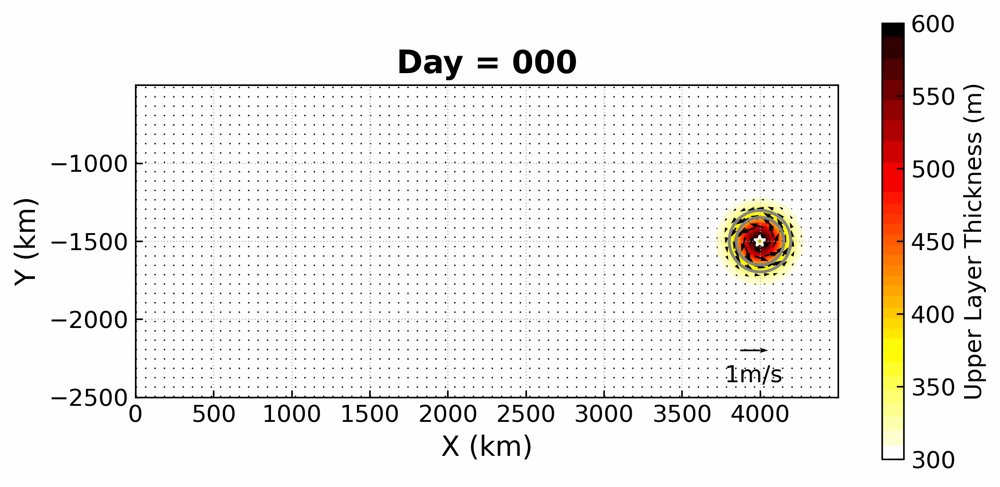
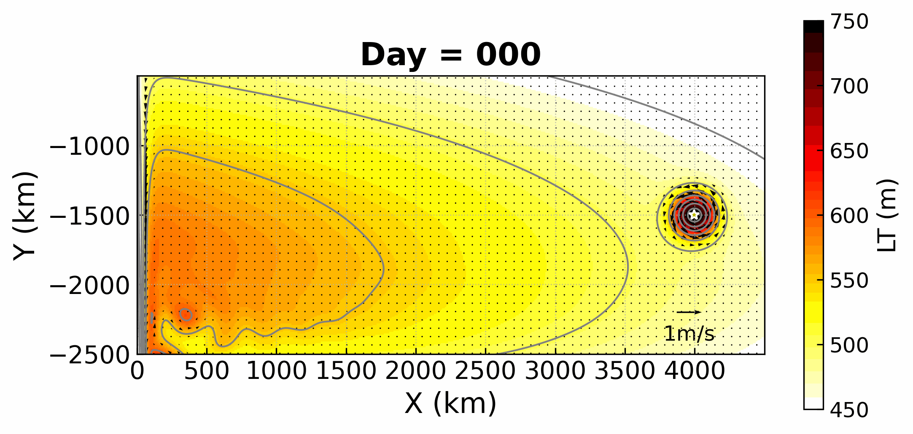
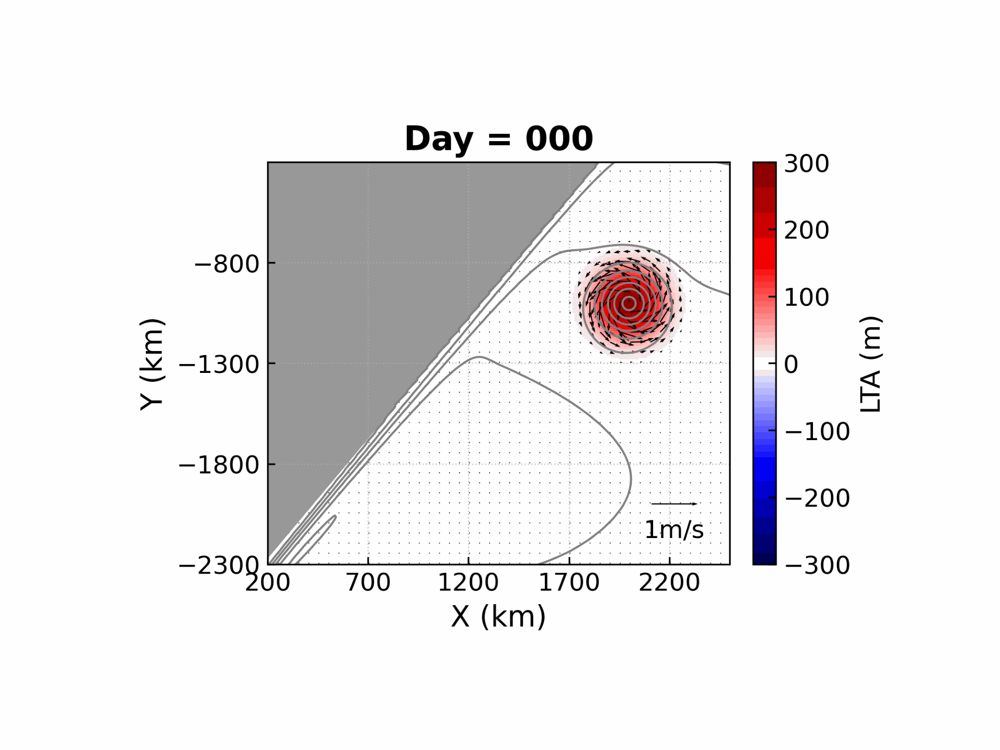
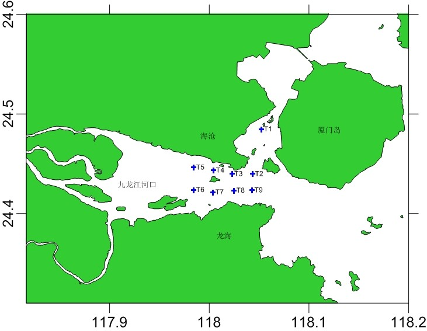
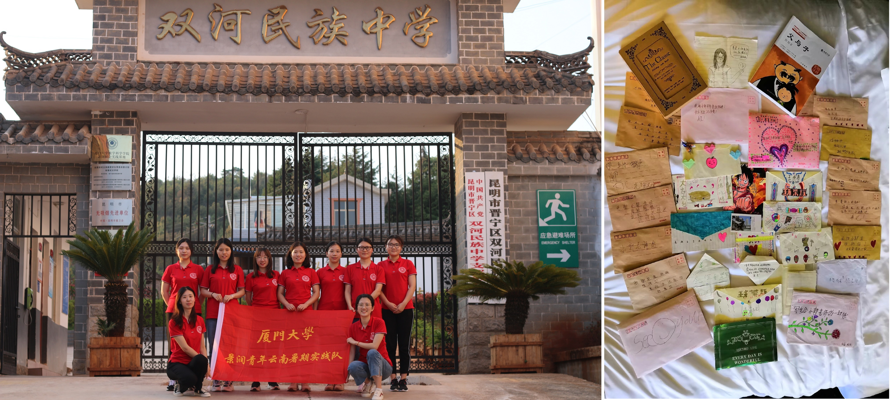

 

# 1-教育背景
---

|时间          | 学位                   | 学校    | 专业          | GPA | 排名  | 
|-------------|------------------------|---------|---------------|-----|------|
| 2019 - 2025 | 硕博（导师：杨小怡教授） | 厦门大学 | 物理海洋学     |**4.0**| 1/19 |
| 2015 - 2019 | 本科                   | 厦门大学 | 数学与应用数学 |**3.6**| 15/116|

---
 

# 2-科研概述
---

## 2.1 研究方向
- **研究方向1**：结合卫星遥感、现场观测与再分析资料，聚焦多尺度相互作用过程（西边界流-中尺度涡等），及能量串级问题
- **研究方向2**：通过数值模型，模拟西边界流-中尺度涡的相互作用过程

## 2.2 研究成果
  - **期刊论文**：

    - **Guo, X.**, Yang, X.-Y., Deng, Q., Lin, H., & Wang, D. (2024). Rhythms of the Agulhas current within the framework of energetic anisotropy. Journal of Geophysical Research: Oceans, 129, e2024JC021044. https://doi.org/10.1029/2024JC021044  （JCR分区：Q1）
    - **Guo, X.**, Yang, X.-Y., Deng, Q., (2025). Numerical Study on the Evolution of Solitary Eddy in Different Structure. Ocean Dynamics. (In preparation)
    -  **Guo, X.**, Yang, X.-Y., Deng, Q., Zhang, Y. (2025). Interactions of Elliptical Mesoscale Eddy and Non-meridional Western Boundary Current: A Reduced-Gravity Numerical Model Study. Journal of Physical Oceanography. (In preparation)

  - **会议报告：** 
    - **Xiamen Symposium on Marine Environmental Sciences 2025**（国际会议）：《Rhythms of the Agulhas Current within the Framework of Eddy Energetic Anisotropy》 
    - **Xiamen Symposium on Marine Environmental Sciences 2023**（国际会议）：《Extreme Acceleration of the Agulhas Current Triggered by Upstream Anticyclones》 
    - **第四届凌峰论坛 2023**：《厄加勒斯流强度，流幅与位置的关系及机理初探》
    - **南强海洋动力论坛 2022**：《厄加勒斯流强度与位置的关系及机理初探》 
    - **第七届MEL研究生学术论坛 2022**：《厄加勒斯流异常强的原因及影响》 
    
## 2.3 合作交流
  - **中山大学海洋科学学院 王东晓 教授课题组** (2024.12 - 2025.01)：合作探究“厄加勒斯流次表层极大现象的季节性变化与极端异常事件” 

## 2.4 前沿探索 
  - **「AI× 海洋」前沿探索：**      
    - 《人工智能：科学化数据分析与机器学习应用》 （2025）获课程优秀荣誉证书
    - 基于Python科学计算和 PyTorch 实现海洋数据智能解析与涡旋特征识别，开拓人工智能在海洋动力研究中的创新应用场景

## 2.5 相关技能 
- 计算机能力：熟练掌握 Matlab、Python等，以及Aronnax数值模拟。
- 语言能力：高分通过英语六级考试(CET-6)，具备良好的英语读写能力。
- 其他：高中数学教师资格证，普通话二级甲等。
  

---
 

# 3-研究课题 
---

## 3.1 能量各向异性框架下厄加勒斯流的“韵律”
### 3.1.1 研究背景与核心目标
厄加勒斯流（Agulhas current, AC）系统同时连接印度洋、大西洋和南大洋，是全球海洋环流的关键节点。厄加勒斯流作为南半球最强的西边界流，其动力变异（强度变化与离岸曲流现象）对区域环流形态及经向热输送过程具有深远影响。本研究（见图1）基于前沿的能量各向异性理论框架，深入解析**AC 加速及离岸曲流现象背后的涡 - 流相互作用机制**，取得了突破性的研究成果。

### 3.1.2 研究内容
  - ### 厄加勒斯流加速的动力机制
    研究发现，AC 流速增强的关键驱动力来自上游反气旋涡旋。当反气旋向西南方向移动并与非洲东岸的 AC 发生碰撞时，二者的相互挤压致使局地流速显著提升，同时等密面坡度增大，最终推动 AC 强度增强。
  - ### 离岸曲流的两种形成机制
    离岸曲流的形成过程更为复杂，涉及两个重要机制：
    （1）本研究首次证实外来气旋能够降低 AC 局地水平位涡梯度，气旋得以穿越西边界流，进而引发 AC 产生脉冲状蜿蜒曲流；
    （2）反气旋与 AC 相互作用所引发的正压不稳定现象，同样会促进曲流的生成。
  - ### 能量反馈的正负循环体系
    基于能量各向异性框架下的涡动能方程，本研究揭示了正压不稳定过程中的两个核心反馈机制：
    （1）反气旋的挤压与气旋曲流的发展会强化涡各向异性，加速正压不稳定进程，并推动正向能量串级，形成促进曲流发展的**正反馈**循环；
    （2）不同于以往研究的假设，反气旋诱导的 AC 加速及气旋曲流的发展会削弱平均流的应变率，从而抑制正向能量串级与曲流发展，构成**负反馈**循环。
    正是这两种反馈机制的协同作用，共同决定了 AC 曲流的演变特征。

### 3.1.3 研究方法的创新与价值
本研究采用的能量各向异性诊断方法，为探究多尺度相互作用提供了**全新视角**。该方法具备良好的**普适性**，有望推广应用于其他西边界流系统的研究，为海洋动力学领域的发展提供重要的理论支持与方法借鉴。

<!-- {:width='900'} -->
<figure style="text-align: center">
  
  <figcaption style="font-size: 0.9em; color: gray; margin-top: 0.5em; text-align: center;"><em>图 1：《能量各向异性框架下厄加勒斯流的“韵律”》研究总结</em></figcaption>
</figure>

## 3.2 数值模拟：反气旋涡-西南向西边界流的相互作用
### 3.2.1 研究背景与核心目标
前人针对孤立涡演化及涡旋与西边界流相互作用的数值模拟，多围绕正圆形反气旋涡和经向（南北向）西边界流展开。然而，近期的研究显示海洋中的涡旋形态以**椭圆形**甚至鸡蛋形为主；且西边界流也**并非是经向**的（如：东北-西南向的厄加勒斯流）。这与传统研究假设存在显著差异。
此外，基于前期研究成果，涡旋在与西边界流相互作用过程中，会发生拉伸与旋转形成椭圆结构，并与西边界流呈特定夹角。从能量各项异性角度分析，**西边界流应变张量与涡动量张量的夹角，对能量串级的方向与强度起着关键作用**。   
鉴于此，仍有诸多科学问题亟待深入探究：不同扁度的孤立涡旋，其演化过程存在何种本质区别？不同扁度、尺度、强度的涡旋，与不同强度、流向角度的西边界流相互作用时，作用过程具有怎样的差异性特征？在上述不同情境下，能量串级机制又呈现出何种独特规律？这些问题的解决，将为深化海洋涡旋动力学研究提供关键理论支撑。

### 3.2.2 研究内容
  - ### 孤立涡的演化
<figure style="text-align: center">
  
  <figcaption style="font-size: 0.9em; color: gray; margin-top: 0.5em; display: inline-block;"><em>图 2：孤立反气旋涡的演化过程</em></figcaption>
</figure>

  - ### 风驱环流背景中涡旋的演化
<figure style="text-align: center">
  
  <figcaption style="font-size: 0.9em; color: gray; margin-top: 0.5em; display: inline-block;"><em>图 3：反气旋涡在背景环流中的演化过程</em></figcaption>
</figure>
  
  - ### 涡-流相互作用
<!-- {:width='568'} -->
<figure style="text-align: center">
  
  <figcaption style="font-size: 0.9em; color: gray; margin-top: 0.5em; display: inline-block;"><em>图 4：反气旋涡旋与西边界流的相互作用过程</em></figcaption>
</figure>

### 3.2.3 研究创新与价值
- 立足海洋观测现实，突破性地针对椭圆涡旋与非经向西边界流相互作用展开探索，填补了该领域存在的空白。
- 推导沿流-跨流坐标系下的跨尺度能量转换框架，提升了对复杂海洋现象的描述能力，具有更实际的使用效应和普适性。

---
 

# 4-教学实践
---
**「物理海洋学基础实验」课程助教**（2021）

- 课堂教学辅助：协助教师开展海洋水文要素（如：深度、温度、盐度等）和气象要素观测原理的课堂讲授。
- 分组实验指导：指导学生掌握常规观测仪器（如：温盐仪、水色计等）的操作方法，监督实验流程的规范性。
- **随船出海实习**： 协助组织乘坐“海洋2号”科考船（站位见图5），指导学生开展定位与水深观测，以及海洋气象（如风速、风向）、海况（水色、透明度）、温度盐度、海流等要素的现场观测，监督仪器使用安全、数据记录的准确性。

<!-- {:width='568'} -->
<figure style="text-align: center">
  
  <figcaption style="font-size: 0.9em; color: gray; margin-top: 0.5em; text-align: center;"><em>图 5：“海洋2号”实习航次站位图</em></figcaption>
</figure>

---
 

# 5-学生工作 & 社会实践
---

## 5.1 学生工作
- 党性思想引领   
  2020-2023年任职**物理海洋第一研究生党支部纪检委员**，监督党内纪律执行：制定推优人选量化指标，规避简单以票取人；推行每日 “学习强国” 督促计划，强化党员理论学习。同时，积极组织党支部活动：包括三校海洋科学党支部共建活动（就业先锋分享会），与公卫学院联合开展防艾同伴教育及 “嘉庚号” 参观活动，以及支部趣味羽毛球比赛等，促进党员交流与凝聚力提升。
- 组织能力锻造   
  2020-2021年担任**海洋与地球学院团总支和研究生会组织部负责人**，主导策划并组织多项大型学生活动：厦门大学校庆志愿活动，翔安校区素质拓展活动，三院联谊活动，以及“同上四史思政课"等，通过协调团队成员分工与协作，保障活动顺利开展。
- 学生服务践行
  - 2016-2017年出任**厦门大学学生会生活服务中心与权益部副主任**，聚焦同学需求，广泛收集学业发展、身心健康、社会融入、权益维护等方面问题，及时向学校反馈并推动有效解决，切实维护学生权益。 
  - 2016-2017年担任**数学科学学院素拓部副部长**，参与组织学院新生破冰素拓、期末减压素拓等活动，助力营造良好学院氛围，增强学生归属感。
  - 2015-2016年同时担任数学科学学院**生活委员**和**心理委员**，定期安排宿舍卫生检查、排除安全隐患；策划并组织了“宿舍文化节”，通过创意装饰、文化口号等活动，提升宿舍生活质量及宿舍凝聚力；配合党支部定期与同学谈心，缓解学业压力、人际关系等方面的困扰。

## 5.2 社会实践
- **“景润青年”云南暑期实践队**（图6）：在云南晋宁双河民族中学开展**扶贫支教**活动。实践队六进云南以来，双河民族中学的升学率从46%增长到78%，位居全区中学第二名。
  - 担任跟班班主任，帮助班级同学理解课堂内容，晚自习驻班答疑；通过趣味形式分享数学学习经验；深入周边少数民族乡镇中小学开展 “酶” 知识科普。
  - 开展主题班会，向同学们介绍厦门大学丰富多彩的校园生活，在同学们心中种下一颗“大学梦”的种子。
  - 参与策划并独立主持五四文体活动活动，涵盖创意时装秀、特色秧佬鼓比赛、《我和我的祖国》拍摄等。
  - 走访双河营村等贫困村，联合队员联系厦大校友设立 “寻找景润少年” 奖学金。
  - 对学生升学意愿进行调研并建立数学模型，发现学生面对困难的态度与榜样建立对升学意愿影响较大，为后续实践提供方向。
  
- **平潭风力发电调研队**：深入平潭综合实验区，走访平潭综合实验区气象局、长江澳风电场等单位，开展风力发电专题调研。**初步激发了我对自然科学，尤其是海洋气象方面的兴趣**。
  - 在气象局系统学习气象监测仪器原理与操作，掌握风速、风向等气象数据采集方法；在风电场学习风电场选址逻辑、叶片角度优化策略等专业知识。
  - 与平潭县政府领导座谈，了解当地风力发电产业发展现状与现存挑战。
  - 通过问卷调研居民、政府工作人员，剖析风力发电对当地环境、生活、经济的多维影响，有效提升实地调研、数据分析与专业沟通能力。

<figure style="text-align: center">
  
  <figcaption style="font-size: 0.9em; color: gray; margin-top: 0.5em; text-align: center;"><em>图 6：支教队在双河民族中学合照，以及学生们写给我的信</em></figcaption>
</figure>

---
 

# 6-奖学金 & 荣誉称号
---

| 名称 | 颁发单位          | 年份                       |
|----------------|---------------|-------------------------------|
| **博海奖学金** | 厦门大学海洋与地球学院      |  2025          | 
| **优秀学生干部** | 厦门大学海洋与地球学院   |  2021     |
| **校级三好学生** | 厦门大学   |  2020     |
| **三好学生荣誉称号** | 厦门大学海洋与地球学院   |  2020     |
| **全国优秀团队奖，最佳传播奖**  | 中国大学生社会实践知行促进计划    |  2019     |
| **暑期社会实践活动“优秀团队”**  | 厦门大学    |  2019     |
| **志愿服务奖学金**  | 厦门大学数学科学学院   |  2018     |
| **优秀学生奖学金**  | 厦门大学   |  2018     |
| **美国大学生数学建模竞赛三等奖**  | 美国数学及其应用联合会   |  2018     |
| **优秀学生奖学金**  | 厦门大学   |  2017     |
| **全国大学生数学建模竞赛二等奖**  | 福建省教育厅   |  2017     |

---
 

# 7-自我评价
---
- 科研特质
  - **学术基础与能力**：在校期间成绩优异，形成了较好的数理基础与逻辑思维能力；有着较强的学习能力和理解能力，逐渐从对海洋环流和动力学一无所知成长为具备基本专业知识和专业素养的学生。
  - **探索与思考能力**：始终保持强烈的好奇心与求知欲，善于在文献阅读和数据分析的过程中发现问题；思维活跃，乐于从多方面思考问题、解决问题。
  - **科研热情与理想**：出于对海洋科学的热爱，主动选择物理海洋专业，渴望为海洋学的发展和对广袤海洋的探索贡献自己的力量，拥有坚定的科研情怀与抱负。

- 性格特质
  - **人生态度**：秉持乐观豁达、积极向上的人生态度，善于自我开解和心理建设，面对学习与生活中的困难不气馁。
  - **沟通与协作能力**：曾广泛参与学生工作，乐于与人沟通，具备合作精神和责任心，团队协作能力较强。
  - **社会责任感**：热心公益事业，长期参与基金会的月捐活动，助力贫困地区教育与医疗改善；积极参与志愿活动，用行动践行社会责任。
  - **全面发展意识**：注重自身综合素质的提升，积极参与各类活动，坚持体育锻炼。

