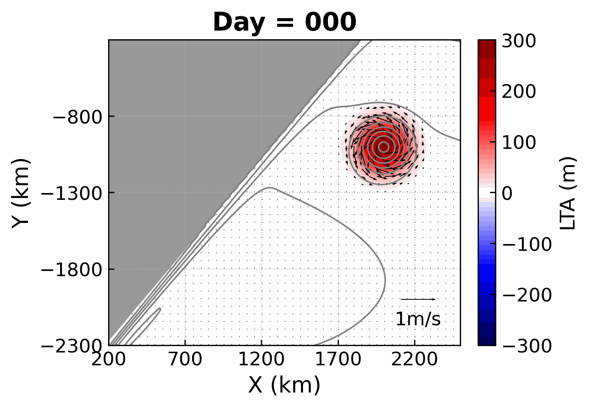

 

# 1-教育背景
---

|时间          | 学位            | 学校    | 专业          | GPA | 排名  | 
|-------------|-----------------|---------|---------------|-----|------|
| 2019 - 2025 | 博士（硕博连读） | 厦门大学 | 物理海洋学     |**4.0**| 1/19 |
| 2015 - 2019 | 本科            | 厦门大学 | 数学与应用数学 |**3.6**| 15/116|

---
 

# 2-科研概述
---

## 2.1 研究方向
- **研究方向1**：结合卫星遥感、现场观测与再分析资料，聚焦多尺度相互作用过程（西边界流-中尺度涡等），及能量串级问题
- **研究方向2**：通过数值模型，模拟西边界流-中尺度涡的相互作用过程

## 2.2 研究成果
  - **期刊论文**（JCR分区：Q1）：

    - **Guo, X.**, Yang, X.-Y., Deng, Q., Lin, H., & Wang, D. (2024). Rhythms of the Agulhas current within the framework of energetic anisotropy. Journal of Geophysical Research: Oceans, 129, e2024JC021044. https://doi.org/10.1029/2024JC021044
    - **Guo, X.**, Yang, X.-Y., Deng, Q., (2025). Numerical Study on the Evolution of Solitary Eddy in Different Structure. Ocean Dynamics. (In preparation)
    -  **Guo, X.**, Yang, X.-Y., Deng, Q., Zhang, Y. (2025). Interactions of Elliptical Mesoscale Eddy and Non-meridional Western Boundary Current: A Reduced-Gravity Numerical Model Study. Journal of Physical Oceanography. (In preparation)

  - **会议报告：** 
    - **Xiamen Symposium on Marine Environmental Sciences 2025**（国际会议）：《Rhythms of the Agulhas Current within the Framework of Eddy Energetic Anisotropy》 
    - **Xiamen Symposium on Marine Environmental Sciences 2023**（国际会议）：《Extreme Acceleration of the Agulhas Current Triggered by Upstream Anticyclones》 
    - **第四届凌峰论坛 2023**：《厄加勒斯流强度，流幅与位置的关系及机理初探》
    - **南强海洋动力论坛 2022**：《厄加勒斯流强度与位置的关系及机理初探》 
    - **第七届MEL研究生学术论坛 2022**：《厄加勒斯流异常强的原因及影响》 
    
## 2.3 合作交流
  - **中山大学海洋科学学院 王东晓 教授课题组** (2024.12 - 2025.01)：合作探究“厄加勒斯流次表层极大现象的季节性变化与极端异常事件” 

## 2.4 前沿探索 
  - **「AI× 海洋」前沿探索：**      
    - 《人工智能：科学化数据分析与机器学习应用》 （2025）获课程优秀荣誉证书
    - 基于Python科学计算和 PyTorch 实现海洋数据智能解析与涡旋特征识别，开拓人工智能在海洋动力研究中的创新应用场景

## 2.5 相关技能 
- 计算机能力：熟练掌握 Matlab、Python等，Aronnax数值模拟。
- 语言能力：通过英语六级考试(CET-6)，具备良好的英语读写能力。
- 其他：高中数学教师资格证，普通话二级甲等。
  

---
 

# 3-研究课题 
---

## 3.1 能量各向异性框架下厄加勒斯流的“韵律”
### 3.1.1 研究背景与核心目标
厄加勒斯流（Agulhas current, AC）系统同时连接印度洋、大西洋和南大洋，是全球海洋环流的关键节点。厄加勒斯流作为南半球最强的西边界流，其动力变异（强度变化与离岸曲流现象）对区域环流形态及经向热输送过程具有深远影响。本研究（见图1）基于前沿的能量各向异性理论框架，深入解析**AC 加速及离岸曲流现象背后的涡 - 流相互作用机制**，取得了突破性的研究成果。

### 3.1.2 研究内容
  - ### 厄加勒斯流加速的动力机制
    研究发现，AC 流速增强的关键驱动力来自上游反气旋涡旋。当反气旋向西南方向移动并与非洲东岸的 AC 发生碰撞时，二者的相互挤压致使局地流速显著提升，同时等密面坡度增大，最终推动 AC 强度增强。
  - ### 离岸曲流的两种形成机制
    离岸曲流的形成过程更为复杂，涉及两个重要机制：其一，本研究首次证实外来气旋能够降低 AC 局地水平位涡梯度，使气旋得以穿越西边界流，进而引发 AC 产生脉冲状蜿蜒曲流；其二，反气旋与 AC 相互作用所引发的正压不稳定现象，同样会促进曲流的生成。
  - ### 能量反馈的正负循环体系
    基于能量各向异性框架下的涡动能方程，本研究揭示了正压不稳定过程中的两个核心反馈机制：一方面，反气旋的挤压与气旋曲流的发展会强化涡各向异性，加速正压不稳定进程并推动正向能量串级，形成促进曲流发展的正反馈循环；另一方面，不同于以往研究的假设，反气旋诱导的 AC 加速及气旋曲流的发展会削弱平均流的应变率，从而抑制正向能量串级与曲流发展，构成负反馈循环。正是这两种反馈机制的协同作用，共同决定了 AC 曲流的演变特征。

### 3.1.3 研究方法的创新与价值
本研究采用的能量各向异性诊断方法，为探究多尺度相互作用提供了全新视角。该方法具备良好的普适性，有望推广应用于其他西边界流系统的研究，为海洋动力学领域的发展提供重要的理论支持与方法借鉴。

<!-- {:width='900'} -->
<figure style="text-align: center">
  
  <figcaption style="font-size: 0.9em; color: gray; margin-top: 0.5em;"><em>图 1：《能量各向异性框架下厄加勒斯流的“韵律”》研究总结</em></figcaption>
</figure>

## 3.2 数值模拟

<!-- {:width='568'} -->

<figure style="text-align: center">
  
  <figcaption style="font-size: 0.9em; color: gray; margin-top: 0.5em;"><em>图 2：反气旋涡旋与西边界流的相互作用过程</em></figcaption>
</figure>

---
 

# 4-教学实践
---
**「物理海洋学基础实验」课程助教**（2021）

- 课堂教学辅助：协助教师开展海洋水文要素（如深度、温度、盐度等）和气象要素观测原理的课堂讲授
- 分组实验指导：指导学生掌握常规观测仪器（如温盐仪、水色计等）的操作方法，监督实验流程的规范性。
- **随船出海实习**： 协助组织乘坐“海洋2号”科考船（站位见图3），指导学生开展定位与水深观测，以及海洋气象（如风速、风向）、海况（水色、透明度）、温度盐度、海流等要素的现场观测，监督仪器使用安全、数据记录的准确性。

<!-- {:width='568'} -->
<figure style="text-align: center">
  
  <figcaption style="font-size: 0.9em; color: gray; margin-top: 0.5em;"><em>图 3：“海洋2号”实习航次站位图</em></figcaption>
</figure>

---
 

# 5-学生工作 & 社会实践
---

## 5.1 学生工作
- 党性思想引领：任职**物理海洋第一研究生党支部纪检委员**（2020-2023年），监督党内纪律执行（如：提出推优人选的量化指标、防止简单以票取人，提出每日“学习强国”督促计划），参与组织党支部活动（如：三校海洋科学党支部共建活动（就业先锋分享会），与公卫学院的共建活动（防艾同伴教育，参观“嘉庚号”），学院趣味羽毛球比赛等）。
- 组织能力锻造：担任**海洋与地球学院团总支和研究生会组织部负责人**（2020-2021年），主导多项大型学生活动策划与组织（如：厦门大学校庆志愿活动，翔安校区素质拓展活动，三院联谊活动，同上四史思政课），协调团队高效运作。
- 学生服务践行： 出任**厦门大学学生会生活服务中心与权益部副主任**（2016-2017年），听取、收集同学在学业发展、身心健康、社会融入、权益维护等方面的普遍需求和现实困难，及时反馈学校，帮助有效解决。 出任**数学科学学院素拓部副部长**（2016-2017年），参与组织学院素质拓展活动（如：学院新生破冰素拓，期末减压素拓）。

## 5.2 社会实践
- **“景润青年”云南暑期实践队**（图4）：在云南晋宁双河民族中学开展**扶贫支教**活动。实践队六进云南以来，双河民族中学的升学率稳步增长，从46%到78%，位居全区中学第二名。
  - 担任跟班班主任，帮助班级同学理解课堂内容，并将自己的数学学习经验通过有趣的形式传授给孩子们；每晚晚自习期间到教室为同学们答疑解惑；去周边少数民族乡镇中小学科普“酶”的奇妙世界。
  - 开展主题班会，向同学们介绍厦门大学丰富多彩的校园生活，在同学们心中种下一颗“大学梦”的种子。
  - 参与策划并独立主持多场五四文体活动活动（如：创意时装秀、特色秧佬鼓比赛、《我和我的祖国》拍摄活动）。
  - 前往双河乡下辖的贫困村（如：双河营村）走访调研。与队员们一起联系厦大校友在双河民族中学设立“寻找景润少年”奖学金。
  - 对学生升学意愿进行调研并数学建模，发现：学生面对困难的态度与榜样的建立对升学意愿影响较大，这为以后实践队提供了方向。

- **平潭风力发电调研队**：深入平潭综合实验区开展**风力发电专题调研**，实地走访平潭综合实验区气象局、长江澳风电场等单位，**对自然科学（尤其是海洋气象方面）产生了浓厚兴趣**。
  - 在气象局系统学习气象监测仪器原理与操作，掌握风速、风向等气象数据采集方法；在风电场聆听专业讲解，系统了解风电场选址逻辑、叶片角度优化策略等知识。
  - 与平潭县政府领导座谈，明晰当地风力发电产业发展现状与现存挑。
  - 通过调查问卷，完成对居民、政府工作人员的走访调研，剖析风力发电对当地环境、生活、经济的多维影响，提升了实地调研、数据分析与专业沟通能力。

<figure style="text-align: center">
  
  <figcaption style="font-size: 0.9em; color: gray; margin-top: 0.5em;"><em>图 4：支教队在双河民族中学合照</em></figcaption>
</figure>

---
 

# 6-奖学金 & 荣誉称号
---

| 名称 | 颁发单位          | 年份                       |
|----------------|---------------|-------------------------------|
| **博海奖学金** | 厦门大学海洋与地球学院      |  2025          | 
| **优秀学生干部** | 厦门大学海洋与地球学院   |  2021     |
| **校级三好学生** | 厦门大学   |  2020     |
| **三好学生荣誉称号** | 厦门大学海洋与地球学院   |  2020     |
| **全国优秀团队奖，最佳传播奖**  | 中国大学生社会实践知行促进计划    |  2019     |
| **暑期社会实践活动“优秀团队”**  | 厦门大学    |  2019     |
| **志愿服务奖学金**  | 厦门大学数学科学学院   |  2018     |
| **优秀学生奖学金**  | 厦门大学   |  2018     |
| **美国大学生数学建模竞赛三等奖**  | 美国数学及其应用联合会   |  2018     |
| **优秀学生奖学金**  | 厦门大学   |  2017     |
| **全国大学生数学建模竞赛二等奖**  | 福建省教育厅   |  2017     |

---
 

# 7-自我评价
---
- 科研特质
  - **学术基础与能力**：在校期间成绩优异，形成了较好的数理基础与逻辑思维能力；有着较强的学习能力和理解能力，逐渐从对海洋环流和动力学一无所知成长为具备基本专业知识和专业素养的学生。
  - **探索与思考能力**：始终保持强烈的好奇心与求知欲，善于在文献阅读和数据分析的过程中发现问题；思维活跃，乐于从多方面思考问题、解决问题。
  - **科研热情与理想**：出于对海洋科学的热爱，主动选择物理海洋专业，渴望为海洋学的发展和对广袤海洋的探索贡献自己的力量，拥有坚定的科研情怀与抱负。

- 性格特质
  - **人生态度**：秉持乐观豁达、积极向上的人生态度，善于自我开解和心理建设，面对学习与生活中的困难不气馁。
  - **沟通与协作能力**：曾广泛参与学生工作，乐于与人沟通，具备合作精神和责任心，团队协作能力较强。
  - **社会责任感**：热心公益事业，长期参与基金会的月捐活动，助力贫困地区教育与医疗改善；积极参与志愿活动，用行动践行社会责任。
  - **全面发展意识**：注重自身综合素质的提升，积极参与各类活动，坚持体育锻炼。

